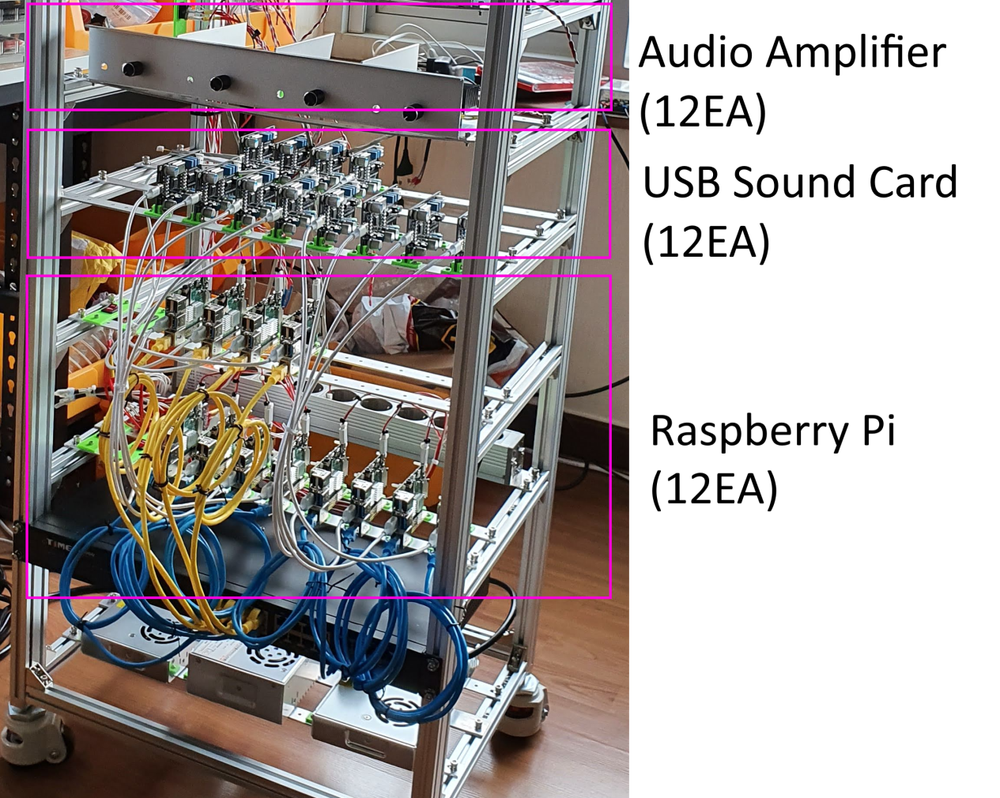

# MIDI file analyzer

I am making a MIDI file player these days.
It is a system that plays only unique instruments by connecting one audio system to each channel of the MIDI file. For this, I prepared 13 Raspberry Pis. Originally, I tried to make it 16 channels, but I omitted 4 for reasons.
One is for play, and the other 12 are connected to a USB sound card, audio amplifier, and full-range speakers for audio playback. In the picture, only the audio card is visible, but there are 12 separate full-range speakers.
<br/><br/>



To play good audio, I need to properly parse the MIDI file I'm trying to play. MIDI channels should be properly assigned to the 12 audio systems. For example, if you want to play a MIDI file containing 15 MIDI channels, you can determine the number of note plays for each channel, and assign one audio system to the channels with high usage and all the channels with low usage to one audio system at a time.
In this way, you can create an optimized channel distribution rule for each MIDI file.
To do this, I need a tool that analyzes the MIDI files. There are various tools to analyze MIDI files, but what I need is summary data for each channel. To do this, I simply created a Python program using the mido package.

## Install mido

First, install mido using the pip or pip3 command. I mainly use python3.

```bash
pip3 install mido

```

## analyze the midi file

It can be used simply by putting the MIDI file name in the parameter.

```bash
===============================================
PS C:\lsh\source\Raspberry\MIDI file analyzer> python .\midi_analyzer.py --file=TestMidiFile.mid
Track 0:
Track 1: Violin
Track 2: Cello
===== channel[0] =====
  instrument[String Ensemble 1] note_in[   0] note_off[   0] control_change[   7] program_change[   1]
  instrument[String Ensemble 1] note_in[  10] note_off[  10] control_change[   0] program_change[   1]
Total event :[29]
===== channel[1] =====
  instrument[String Ensemble 1] note_in[   0] note_off[   0] control_change[   3] program_change[   1]
  instrument[String Ensemble 1] note_in[   6] note_off[   6] control_change[  26] program_change[   1]
Total event :[43]
===============================================
```


